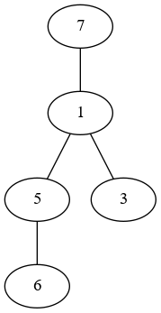

### 最优二叉树II
```
时间限制：C/C++ 1秒，其他语言2秒
空间限制：C/C++ 256M，其他语言512M
```

小团有一个由N个节点组成的二叉树，每个节点有一个权值。定义二叉树每条边的开销为其两端节点权值的乘积，二叉树的总开销即每条边的开销之和。小团按照二叉树的中序遍历依次记录下每个节点的权值，即他记录下了N个数，第i个数表示位于中序遍历第i个位置的节点的权值。之后由于某种原因，小团遗忘了二叉树的具体结构。在所有可能的二叉树中，总开销最小的二叉树被称为最优二叉树。现在，小团请小美求出最优二叉树的总开销。

**输入描述**:
> 第一行输入一个整数N（1<=N<=300），表示二叉树的节点数。
> 
> 第二行输入N个由空格隔开的整数，表示按中序遍历记录下的各个节点的权值，所有权值均为不超过1000的正整数。


**输出描述**:
> 输出一个整数，表示最优二叉树的总开销。


**输入例子1**:
> 5 \
> 7 6 5 1 3

**输出例子1**:
> 45

**例子说明1**:
> 
>
> 最优二叉树如图所示，总开销为7*1+6*5+5*1+1*3=45。
